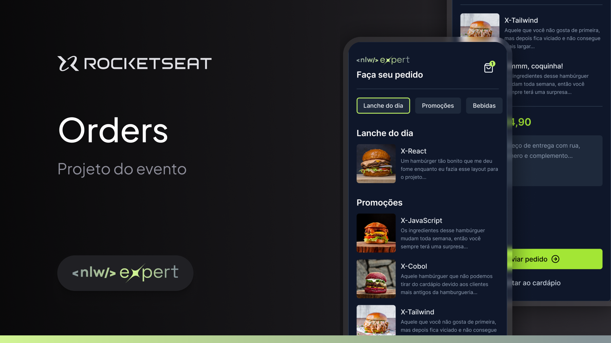

# NLW Expert: React Native - Rocketseat 🚀

---

#### Descrição do Projeto
Este projeto foi desenvolvido durante o evento **NLW 14 Expert** da Rocketseat, uma imersão intensiva voltada para o aprendizado e aplicação de React Native no desenvolvimento de aplicativos móveis modernos. A aplicação criada foca em práticas e ferramentas que otimizam a experiência do desenvolvedor e proporcionam funcionalidades avançadas aos usuários.

---

#### Principais Aprendizados 🧠
Durante o desenvolvimento deste projeto, foram abordados conceitos fundamentais e avançados, incluindo:

- **Estruturação de Projetos React Native**: Organização de pastas e separação de responsabilidades.
- **Navegação com `expo-router`**: Utilização do roteador baseado em arquivos para facilitar a navegação.
- **Estilização com TailwindCSS e Nativewind**: Estilização declarativa e responsiva no ambiente React Native.
- **Estado Global com Zustand**: Gerenciamento de estado simples e eficaz para componentes.
- **Integração de Fontes e Ícones**: Uso de `@expo-google-fonts/inter` e `@expo/vector-icons` para personalização visual.
- **UX e Interatividade**: Manipulação do teclado com `react-native-keyboard-aware-scroll-view` e gerenciamento de áreas seguras com `react-native-safe-area-context`.
- **Persistência de Dados com Async Storage**: Armazenamento local utilizando `@react-native-async-storage/async-storage`.
- **Animações**: Criação de animações fluidas e interativas com `react-native-reanimated`.

---

#### Funcionalidades do Aplicativo 📱
- Interface amigável e responsiva.
- Navegação fluida entre as telas.
- Salvamento local de dados do usuário.
- Estilização dinâmica com suporte a temas.
- Compatibilidade com múltiplos dispositivos (iOS e Android).

---

#### Dependências Utilizadas 🛠️

- **`@expo-google-fonts/inter`**: Conjunto de fontes do Google para personalização de textos.
- **`@expo/vector-icons`**: Biblioteca para integração de ícones populares.
- **`@react-navigation/native`**: Ferramenta essencial para navegação no React Native.
- **`expo-router`**: Roteamento simplificado baseado em arquivos.
- **`nativewind` e `tailwindcss`**: Frameworks para estilização rápida e responsiva.
- **`zustand`**: Gerenciador de estado global minimalista.
- **`react-native-reanimated`**: Biblioteca para animações nativas e fluidas.
- **`react-native-keyboard-aware-scroll-view`**: Solução para problemas de interação com o teclado.
- **`@react-native-async-storage/async-storage`**: Armazenamento local para persistência de dados.

---

#### Imagens do Projeto



#### Como Executar o Projeto 🚀

1. **Pré-requisitos**:
   - Node.js
   - Expo CLI
   - Dispositivo ou emulador Android/iOS.

2. **Clonar o Repositório**:
   ```bash
   git clone https://github.com/ReinanGui/NLW_14_Expert_Mobile.git
   cd mobile
   ```

3. **Instalar Dependências**:
   ```bash
   npm install
   ```

4. **Executar o Projeto**:
   ```bash
   npx expo start
   ```

5. **Acessar no Dispositivo**:
   - Escaneie o QR Code gerado no terminal com o aplicativo Expo Go.

---

#### Conclusão
O projeto não apenas reforça habilidades em React Native, mas também explora ferramentas que aumentam a produtividade e a qualidade do desenvolvimento. A participação no **NLW 14 Expert** foi uma experiência enriquecedora e prática para quem busca se destacar no desenvolvimento mobile.

**Feito com 💜 pela comunidade Rocketseat.**

